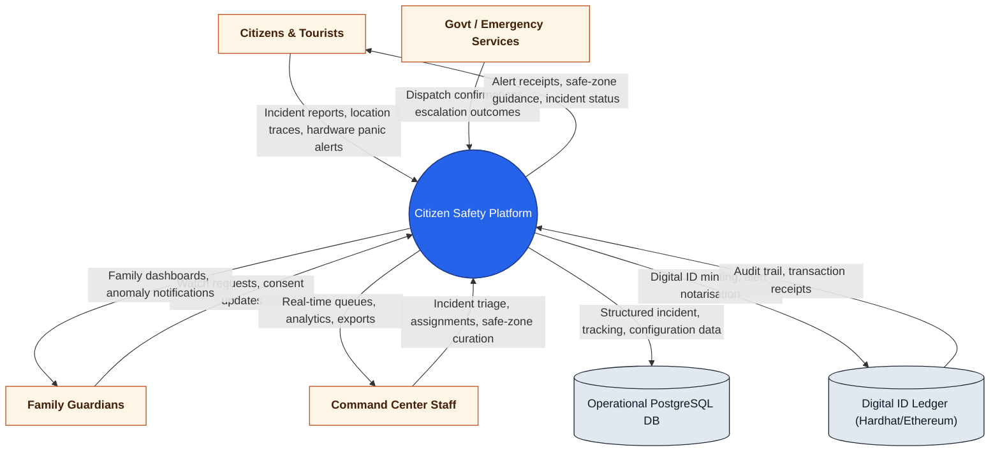
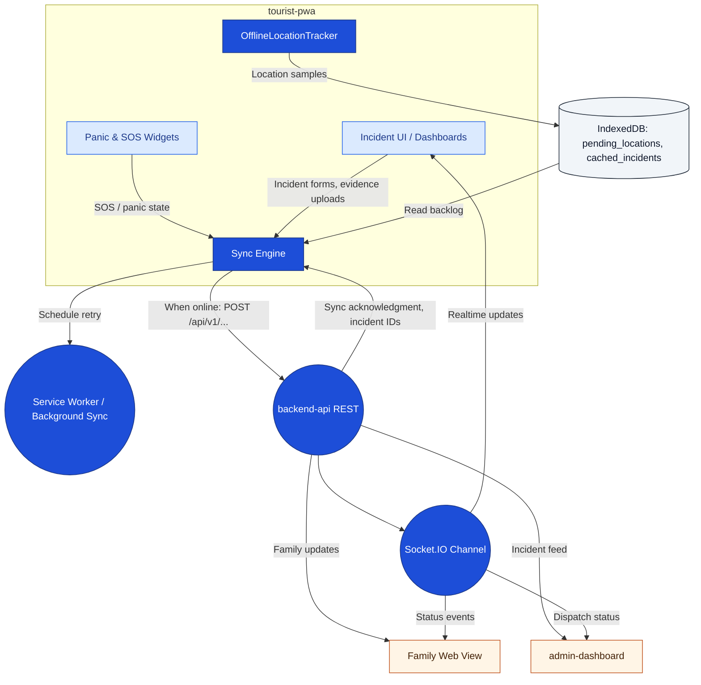

# Citizen Safety Platform – Data Flow Diagram

## Scope & Objective
- Capture how data moves end-to-end across every major runtime in this monorepo (tourist PWA, admin dashboard, backend API, AI services, blockchain, offline pipelines, SMS worker).
- Highlight trust boundaries, persistent stores, and external integrations so teams can reason about security, scaling, and testing impacts.
- Provide drill-down views (context ➜ subsystem ➜ feature flows) that future contributors can reference while shipping or auditing new capabilities.

## Legend
- **External Entity**: Rectangle (light sand) – actors or third-party systems outside direct control.
- **Process / Service**: Rounded node (blue) – executable unit that transforms or routes data.
- **Channel / Client Module**: Soft-blue rectangle – UI or device bridge owned by the team.
- **Data Store**: Cylinder (gray) – persistent storage or queue.
- **Data Flow**: Labeled arrow – indicates payload direction and intent.

## Level 0 – Context Overview
Primary actors interacting with the unified platform and the core data stores they depend on.



## Level 1 – Platform Modules & Integrations
Breakdown of runtime services, primary channels, and external touchpoints powering the system.

```mermaid
flowchart TB
    classDef external fill:#FFF5E6,stroke:#C05621,stroke-width:1.1px,color:#422006,font-weight:bold;
    classDef process fill:#1D4ED8,stroke:#1E3A8A,stroke-width:1.3px,color:#FFFFFF;
    classDef channel fill:#DBEAFE,stroke:#2563EB,stroke-width:1.1px,color:#1E3A8A;
    classDef datastore fill:#F1F5F9,stroke:#1F2937,stroke-width:1.2px,color:#0F172A;

    subgraph Frontline_Channels["Frontline Interfaces"]
        PWA["tourist-pwa (React PWA)"]:::channel
        OfflineStore[("IndexedDB Offline Cache")]:::datastore
        SMSFallback["SMS / USSD Fallback"]:::channel
        Hardware["Hardware Panic Trigger (Volume/Power)"]:::channel
    end

    subgraph Admin_Channels["Operational Consoles"]
        AdminUI["admin-dashboard (React)"]:::channel
    end

    subgraph Core_Services["Citizen Safety Core"]
        API(("backend-api (Express)")):::process
        Socket(("Realtime Gateway (Socket.IO)")):::process
        Worker(("SMS Worker + Cron")):::process
    end

    subgraph Intelligence["Risk & Geospatial Intelligence"]
        GeoAI(("ai-service (Flask Geofence)")):::process
        RiskAI(("Smart anomaly detector (FastAPI)")):::process
    end

    subgraph Persistence["Persistent Stores"]
        Postgres[("PostgreSQL (incidents, safe_zones, sms_queue, blockchain mirrors, hardware panic)")]:::datastore
        SQLite[("Smart anomaly detector SQLite / CSV"):::datastore]
        Blockchain[("Digital ID Smart Contract"):::datastore]
    end

    Twilio["Twilio SMS / WhatsApp"]:::external
    Email["SMTP / Nodemailer"]:::external
    Maps["OpenStreetMap & Geocoding APIs"]:::external
    Govt["Govt / Emergency Integrations"]:::external
    FamiliesExt["Family Guardians"]:::external
    CitizensExt["Citizens / Tourists"]:::external
    AdminsExt["Command Staff"]:::external

    CitizensExt -->|Incident forms, location sync, panic trigger| PWA
    PWA -->|REST/WS requests| API
    PWA -->|Offline buffering| OfflineStore
    OfflineStore -->|Sync batches when online| API
    SMSFallback -->|SOS payload (queued)| API
    Hardware -->|Trigger events| API

    API -->|Incident status, safe zones, alerts| PWA
    API -->|Family dashboards, watchlists| FamiliesExt
    API -->|Assignments, map overlays| AdminUI
    AdminUI -->|Status updates, forward actions| API
    AdminsExt -->|Policy & escalation inputs| AdminUI

    API -->|Event stream| Socket
    Socket -->|WebSocket pushes| PWA
    Socket -->|Live dashboards| AdminUI

    API -->|Incident persistence, queue writes| Postgres
    Worker -->|Queue polling & updates| Postgres
    API -->|Anomaly scoring requests| GeoAI
    API -->|Trajectory batches| RiskAI
    GeoAI -->|Geofence anomaly score| API
    RiskAI -->|Risk score, SHAP factors| API
    RiskAI -->|Prediction archive| SQLite

    API -->|SMS enqueue| Postgres
    Worker -->|Delivery attempts| Twilio
    Twilio -->|Delivery receipts| Worker
    Worker -->|Receipt sync| Postgres

    API -->|Email OTP / advisories| Email
    Email -->|Delivery status| API
    API -->|Digital ID mint, alert notarisation| Blockchain
    Blockchain -->|Tx receipt, audit trail| API

    API -->|Nearby service lookup| Maps
    Maps -->|Reverse geocode, POI| API
    API -->|Dispatch packets| Govt
    Govt -->|Response status| API
```

## Level 2 – `backend-api` Service Internals
Core Express service subdivided into functional modules, queues, and integration adapters.

```mermaid
flowchart LR
    classDef process fill:#1D4ED8,stroke:#1E3A8A,stroke-width:1.2px,color:#FFFFFF;
    classDef datastore fill:#F1F5F9,stroke:#1F2937,stroke-width:1.1px,color:#0F172A;
    classDef external fill:#FFF5E6,stroke:#C05621,stroke-width:1.1px,color:#422006;

    Gateway((API Gateway
    /index.js/)):::process
    Auth((Auth & JWT)):::process
    Incident((Incident Controller)):::process
    WomenSvc((Women Safety Service)):::process
    Panic((Hardware Panic Service)):::process
    OfflineSOS((Offline SOS / SMS Queue)):::process
    SafeZones((Safe Zones API)):::process
    GovConnector((Gov Connector Adapter)):::process
    BlockchainAdapter((Blockchain Adapter)):::process
    GeofenceAdapter((AI / Geofence Adapter)):::process
    RiskAdapter((Risk Scoring Adapter)):::process
    Mailer((Email & OTP Worker)):::process

    Incidents[(incidents, incident_forwards)]:::datastore
    Users[(tourists, women_profiles, auth tables)]:::datastore
    Queue[(sms_queue, panic_triggers)]:::datastore
    Geo[(safe_zones, geo caches)]:::datastore
    BlockchainMirror[(blockchain_*)]:::datastore

    Postgres[(PostgreSQL)]:::datastore
    Twilio["Twilio"]:::external
    Email["SMTP"]:::external
    GeoAI["Flask AI"]:::external
    RiskAI["FastAPI Risk"]:::external
    Hardhat["Hardhat Node"]:::external
    Maps["OpenStreetMap APIs"]:::external
    Responders["Govt Services"]:::external

    Gateway --> Auth
    Gateway --> Incident
    Gateway --> WomenSvc
    Gateway --> Panic
    Gateway --> OfflineSOS
    Gateway --> SafeZones

    Incident -->|CRUD| Incidents
    Incident --> GovConnector
    GovConnector --> Responders

    WomenSvc -->|Profile updates| Users
    WomenSvc --> BlockchainAdapter

    Panic -->|Trigger log| Queue
    Panic --> OfflineSOS

    OfflineSOS -->|Enqueue SMS| Queue
    Queue --> Mailer
    Mailer --> Twilio
    Mailer --> Email

    SafeZones -->|Queries| Geo
    SafeZones --> Maps

    BlockchainAdapter --> Hardhat
    BlockchainAdapter --> BlockchainMirror

    GeofenceAdapter --> GeoAI
    GeoAI --> GeofenceAdapter
    RiskAdapter --> RiskAI
    RiskAI --> RiskAdapter

    Incident --> GeofenceAdapter
    Incident --> RiskAdapter

    {Incidents, Users, Queue, Geo, BlockchainMirror} --> Postgres
    Postgres --> Gateway
```

## Level 2 – Frontline Client & Offline Sync
Detailed flow between the PWA, offline storage, anomaly scoring, and family/admin consumers.



## Data Stores & Key Payloads

| Store | Location | Primary Payloads | Producers | Consumers |
| --- | --- | --- | --- | --- |
| `incidents`, `incident_forwards` | PostgreSQL (`backend-api/db.js`) | Incident records, escalation history, responder assignments | Tourist PWA, Admin dashboard, Hardware panic workflows | Admin dashboard, reporting exports, Gov connectors |
| `sms_queue` | PostgreSQL | Deferred SMS/WhatsApp payloads (offline SOS, panic escalation) | Offline SOS API, hardware panic service | `smsWorker`, Twilio |
| `safe_zones` | PostgreSQL | Geofenced safe zones, metadata, verification state | Admin dashboard | Tourist PWA, Geo anomaly checks |
| `hardware_panic_*` | PostgreSQL | Panic trigger config, telemetry, alert history | Hardware panic service, PWA | Analytics dashboards, auditing |
| `blockchain_*` mirror tables | PostgreSQL | Cached blockchain transactions, alerts, emergencies | Blockchain adapter | Audit UI, analytics, fallbacks when chain unavailable |
| IndexedDB (`tourist-pwa`) | Browser | Offline location breadcrumbs, pending incidents, cached safe zones | Offline tracker, service worker | Sync engine on reconnect |
| CSV / `predictions.db` | Smart anomaly detector service | Trajectory buffers, risk predictions, SHAP explanations | Backend API (batch sends) | Risk API responses, analytics |

## Flow Narratives

**Incident Reporting (Online):**
1. Citizen submits an incident via `tourist-pwa` UI; payload travels over HTTPS to `backend-api`.
2. API validates, writes to `incidents`, forwards to government connector, pings AI services for risk scoring.
3. `Socket.IO` pushes live status to the reporter, families, and admin dashboard; escalations update responders via configured adapters.

**Offline Location Sync:**
1. `OfflineLocationTracker` logs points into IndexedDB while offline.
2. Connectivity listeners trigger `SyncService` or background sync to drain pending items via `POST /api/v1/locations/batch` (or equivalent) when the network is restored.
3. Successful responses prune IndexedDB; risk services receive the same batches for scoring.

**Hardware Panic Escalation:**
1. Native bridge or hardware trigger sends payload to `backend-api`.
2. Panic metadata logged in `hardware_panic_triggers`; an incident stub is created, SMS queue entries enqueued, blockchain log optionally minted.
3. `smsWorker` polls `sms_queue`, attempts Twilio delivery, and updates audit columns for retry logic.

**Smart Anomaly Detection:**
1. Backend posts breadcrumb batches to FastAPI `/predict` endpoints.
2. Service produces risk score, SHAP factors, zone context; persists to `predictions.db` and returns to API.
3. API surfaces risk to frontline clients (e.g., family dashboards) and may auto-trigger alerts or zone advisories.

**Digital ID & Audit Trail:**
1. On registration or critical alert, API invokes blockchain adapter to `mintDigitalId` or `logEmergency`.
2. Transaction hashes and metadata are mirrored into Postgres for quick lookup; confirmations fetched via Hardhat node monitor.
3. Admin dashboard can review on-chain state through cached tables, while raw receipts remain verifiable on the ledger.

---
This document should evolve with new modules. When adding features, update the relevant diagram layers and payload table so downstream squads maintain a reliable mental model of data movement.
